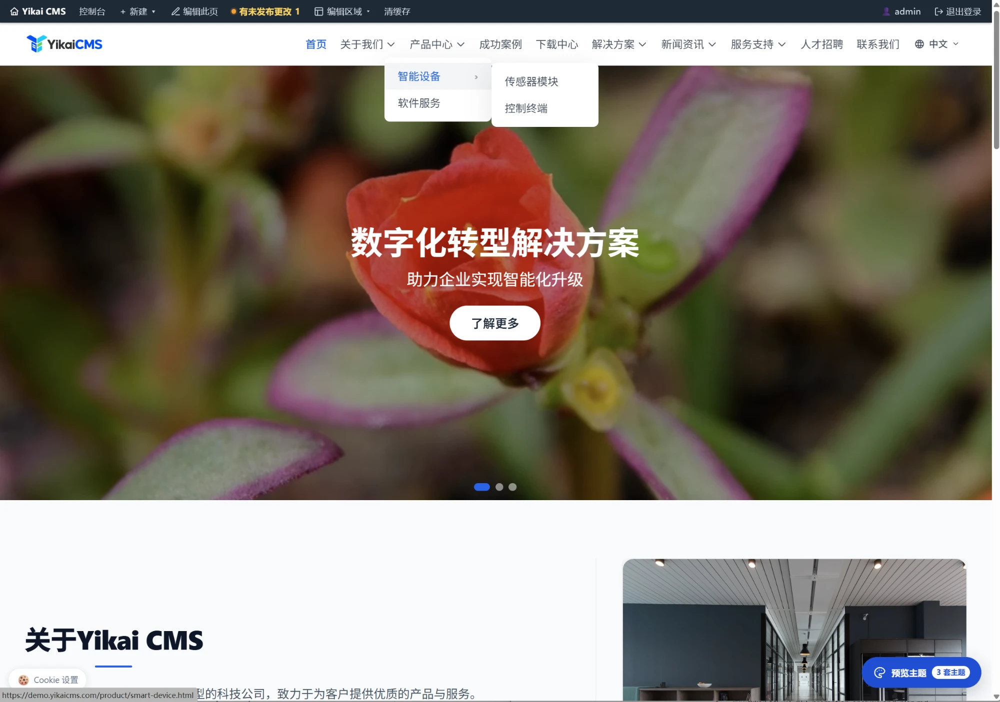
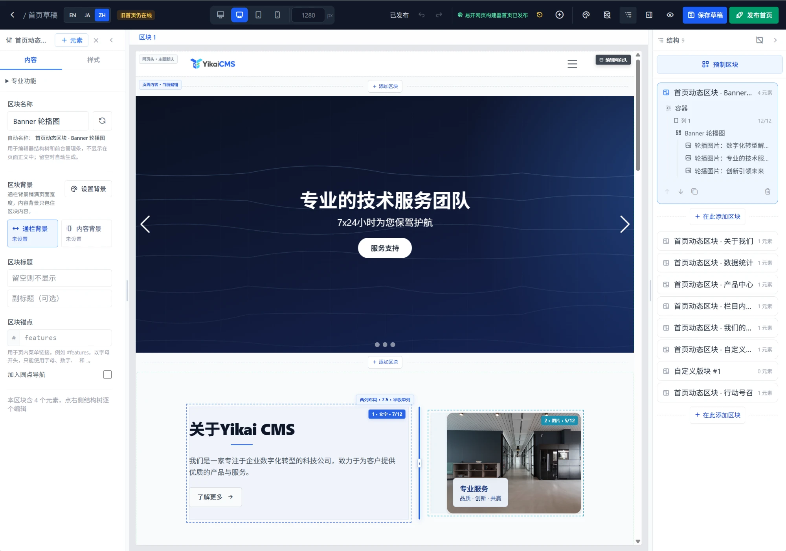

# YikaiCMS v1.20.1

> **面向企业官网与外贸网站的轻量 PHP CMS** · 源码公开，免费商用

[](https://github.com/bluesailor/yikaicms/releases/latest)
[](https://github.com/bluesailor/yikaicms/actions/workflows/ci.yml)
[](https://www.php.net/)
[](./LICENSE)

**[在线演示](https://demo.yikaicms.com)** · **[下载最新版](https://github.com/bluesailor/yikaicms/releases/latest)** · **[使用教程](https://www.yikaicms.com/tutorial.php)** · [官网](https://www.yikaicms.com) · [更新日志](https://www.yikaicms.com/changelog.html)

<p align="center">
  
  
</p>
<p align="center"><sub>左：前台首页（Default 主题） · 右：易开网页构建器可视化编辑首页</sub></p>

**简体中文** · 轻量、多语言、可视化的企业建站系统：PHP 原生部署，MySQL / SQLite 均可；企业官网常用的栏目、产品、新闻、案例、表单询盘、SEO 都已内置，不用装一堆插件；支持简体中文、English、日本語多语言站点。

**English** · A lightweight PHP CMS for business and export websites: deploys on plain PHP with MySQL or SQLite, ships the columns, products, news, cases, inquiry forms and SEO a company site needs, and builds multilingual sites in Chinese, English and Japanese. Source available and free for commercial use.

**日本語** · 企業サイト・海外向けサイトのための軽量 PHP CMS。PHP だけで動作し、MySQL / SQLite に対応。カテゴリ、製品、ニュース、事例、問い合わせフォーム、SEO を標準搭載し、中国語・英語・日本語の多言語サイトを構築できます。ソース公開・商用無料。

---

## 适合谁

- 企业官网、制造业官网、外贸多语言站
- 为客户建站的网络公司、自由职业者
- 熟悉宝塔面板 / 虚拟主机、想要 PHP 直接部署的站长和 PHP 开发者

一个网站十几个栏目、几百个产品、一两千条内容——这类企业站用 YikaiCMS 开箱即可完成。
大型电商、社区论坛这类场景不是它的目标。

## 3 分钟安装

1. 下载完整包 [yikaicms-v1.20.1.zip](https://github.com/bluesailor/yikaicms/releases/download/v1.20.1/yikaicms-v1.20.1.zip)（校验文件 [yikaicms-v1.20.1.sha256](https://github.com/bluesailor/yikaicms/releases/download/v1.20.1/yikaicms-v1.20.1.sha256)），解压上传到网站根目录；
2. 确保 `/config/`、`/uploads/`、`/storage/` 可写，浏览器访问 `http://你的域名/install/`，按向导选择 MySQL 或 SQLite 完成安装；
3. 配置伪静态（宝塔面板：站点 → 设置 → 伪静态，写入一行 `include /www/wwwroot/<你的站点目录>/deploy/nginx-baota.conf;`）。

各类主机的伪静态写法、安全规则与常见 404 排查见下文 [安装与部署](#安装与部署)。

## 核心能力

- **企业建站内容** — 无限层级栏目，文章、产品（多级分类 / 规格参数 / 图片组）、案例、下载、招聘、相册、单页、发展历程
- **易开网页构建器（Yikai Builder）** — 可视化拖拽编辑页面、首页、网页头 / 网页尾与详情页模板，桌面 / 平板 / 手机分档预览与设置
- **多语言与外贸** — 中英日多语言站点，按语言编辑内容与首页区块，多语言 URL 与 SEO
- **表单与询盘** — 可视化表单设计、产品询盘、邮件通知、垃圾信息防护
- **SEO** — Sitemap、OG 标签、Canonical、站长验证、自定义网址
- **AI 内容助手** — 标题、摘要、正文、SEO 与翻译辅助，支持 OpenAI、Claude、DeepSeek、通义千问、智谱
- **主题与插件** — 随包 3 套主题，插件 Hooks，后台插件市场与模板市场（签名校验）
- **运维** — 角色权限、备份恢复、在线升级（完整包 / 增量包）、站点健康检查

<details>
<summary><b>功能详情</b></summary>

### 内容管理
- **栏目管理** — 无限层级栏目树，拖拽排序，多种栏目类型（列表、单页、产品、案例、下载、招聘、相册、外链）
- **产品中心** — 多级分类，品牌、标签、图片组、规格参数、价格；产品与产品分类支持自定义网址
- **文章系统** — 多分类管理，置顶 / 推荐 / 热门标记，HugeRTE 富文本编辑
- **案例、招聘、下载** — 行业方案与成功案例；职位发布与筛选；文件分类、本地上传与外链、下载计数
- **单页与发展历程** — 企业简介、服务流程等静态页面；时间线多种布局，`[timeline]` 短码可嵌入任意页面
- **自定义内容模型** — 后台定义内容类型（团队 / 解决方案 / FAQ…），自动获得增删改查与前台列表 / 详情

### 易开网页构建器
- **可视化编辑** — 区块 → 列 → 元素三层结构，拖拽排序，常用元素开箱即用（标题、富文本、图片、按钮、视频、卡片、轮播、导航、表单、价格方案、客户评价等）
- **实时预览** — 桌面 / 平板 / 手机与宽屏断点，响应式间距与显示控制
- **模板与区块库** — 内置整页模板、页头 / 页脚预设与常用区块，一键插入
- **详情页模板** — 产品详情、文章详情独立模板，按分类 / 栏目指定适用范围
- **专业功能** — 循环模板、显示条件、全局样式、表格、价格方案编辑由「易开网页构建器 Pro」插件提供（需专业授权，从插件市场安装）

### 首页与主题
- **首页区块** — 轮播图、关于我们、数据统计、核心优势、栏目内容、客户评价、合作伙伴、CTA，可按语言编辑，拖拽排序、独立开关
- **随包主题** — Default（标准）、Business（商务）、Minimal（极简）；更多主题在后台「主题 → 模板市场」按需安装
- **模板覆盖** — layouts / blocks / partials 三层模板，theme.json 规范校验

### 媒体与互动
- **媒体库与相册** — 图片与文件统一管理，自动缩略图；多相册拖拽排序
- **轮播图** — PC / 移动端双图、定时展示、分组管理
- **表单与询盘** — 可视化表单设计器，`[form-slug]` 短码嵌入；产品详情页内联询盘，多阶段状态管理，邮件模板
- **会员与社交** — 前台注册登录、下载登录限制；20+ 社交平台图标配置；友情链接

### AI 内容助手
- 支持 OpenAI、Claude (Anthropic)、DeepSeek、通义千问 (Qwen)、智谱 (GLM)
- 一次生成标题、摘要、标签、URL 别名与正文；改写润色、续写、SEO 优化、摘要生成
- API Key 加密存储，调用日志与 Token 用量统计

### 系统管理
- **角色权限** — 多角色，按内容类型细分的编辑 / 删除权限
- **数据库** — 一键备份、按表导出、SQL 导入、日志清理
- **升级** — 内置升级检测，完整包与增量包在线升级，升级前自动备份
- **SEO 与安全** — Sitemap / OG / Canonical / 站长验证；登录保护、IP 白名单、表单防刷
- **扩展字段** — 自定义内容 / 产品字段

### 插件

**随包预装**：返回顶部、Cookie 同意横幅（GDPR / PIPL，Google Consent Mode v2）、产品导入。

**插件市场**（后台「插件管理 → 插件市场」，SHA256 + RSA 签名校验）：网站公告、后台菜单排序、数据库搜索替换、网站统计接入、SEO 助手、LOGO 制作、产品轮播、易登录，以及需专业授权的易开网页构建器 Pro。

</details>

---

## 安装与部署

### 环境要求

| 项目 | 要求 |
|------|------|
| PHP | >= 8.0（建议 8.2+） |
| 数据库 | MySQL 5.7+ / MySQL 8.0+（utf8mb4）或 SQLite 3 |
| Web 服务器 | Apache（启用 `mod_rewrite`）或 Nginx |
| PHP 扩展（必需） | pdo、json、mbstring、fileinfo、dom |
| PHP 扩展（推荐） | curl、openssl、gd、zip、simplexml（在线升级、缩略图、授权校验与 XLSX 导入需要） |

> 以上要求由 `includes/RuntimeRequirements.php` 统一定义，安装器、站点健康检查与兼容层都从那里读取；
> 改要求请只改那一处。`simplexml` 核心不依赖，仅 product-import 插件读 XLSX 时用到。

### 1. 下载部署

- 完整安装包：[yikaicms-v1.20.1.zip](https://github.com/bluesailor/yikaicms/releases/download/v1.20.1/yikaicms-v1.20.1.zip)，发布说明见 [v1.20.1 Release](https://github.com/bluesailor/yikaicms/releases/tag/v1.20.1)；每个版本附 `.sha256` 校验文件。
- 已安装的站点可在后台「系统设置 → 系统升级」在线升级，无需手动下载。
- 开发者也可以直接克隆仓库：`git clone https://github.com/bluesailor/yikaicms.git`

确保以下目录可写：`/config/`、`/uploads/`、`/storage/`

### 2. 运行安装向导

浏览器访问 `http://你的域名/install/`，按向导完成安装。

支持 MySQL 和 SQLite 两种数据库。

### 3. 配置伪静态

**「首页正常，点栏目就 404」几乎都是这一步没做。**

YikaiCMS 内置 PHP 路由分发器（`includes/Dispatcher.php`），只要把「不存在的文件」
统一交给 `index.php`，剩下的路由由 PHP 完成。
所以多数主机不需要逐条 rewrite，配一条 catch-all 即可。

#### Apache

`.htaccess` 已内置，确保启用 `mod_rewrite` 且 `AllowOverride All`。

#### 宝塔面板（Nginx）

站点 → **设置** → **伪静态**，把下面这一行写进去并保存（无需重启）：

```nginx
include /www/wwwroot/<你的站点目录>/deploy/nginx-baota.conf;
```

随包的 `deploy/nginx-baota.conf` 除了路由规则，还封禁了 `config/`、`storage/`、
`install/sql/` 等敏感目录，并拒绝执行 `uploads/` 里的 PHP。升级解压新包会一并更新
这个文件，宝塔「重载配置」即生效。不想用 include 的话，把该文件内容整段粘进伪静态框
也可以，但每次升级都要重新粘一次。

> ⚠ **不要只选 wordpress 预设。** 它只有一条 catch-all：
>
> ```nginx
> location / {
>     try_files $uri $uri/ /index.php?$query_string;
> }
> ```
>
> `try_files` 会先放行**磁盘上真实存在的文件**，而 SQLite 站点的数据库就在站点目录内的
> `storage/database.sqlite`。没有额外的拒绝规则时，它会走静态文件通道直接被下载，
> 根本不经过应用鉴权；包内的 `.htaccess` 只对 Apache 有效，nginx 不读。
> 部署完请当场验证：浏览器访问 `/storage/database.sqlite` 必须是 403 或 404。

#### 阿里云 / 万网 云虚拟主机

主机控制面板 → **高级环境设置** → **NGINX 设置**，把默认的
`location / {}` 与 `location ~ /\.ht {deny all;}` 两段**整体替换**为下面内容，
保存即生效（无需重启）：

```nginx
# 1) 拦截敏感目录与文件
location ~ ^/(config|storage|vendor|includes|install/sql|bin|migrations|recipes)/ {
    deny all;
}
location ~ /\.(git|env|htaccess|htpasswd) {
    deny all;
}
location ~ ^/(composer\.(json|lock)|package(-lock)?\.json)$ {
    deny all;
}

# 2) 主规则：真实文件直出，其余交给 index.php
location / {
    if (!-e $request_filename) {
        rewrite ^ /index.php last;
    }
}
```

> 该面板只允许 `location` / `allow` / `deny` / `try_files` / `rewrite` / `return` / `if` / `set`，
> 且后七者必须写在 `location` 内——上面的写法已经遵守这些限制。
> 同样内容也放在源码的 `deploy/aliyun-nginx-minimal.txt`。

#### 自建 Nginx

完整示例见源码 `deploy/nginx-server.conf`，改完 `nginx -s reload`。

#### 配好了仍然 404？

按顺序排查：栏目是否已启用 → 别名（slug）是否与其它栏目/单页重名 →
栏目类型是否为「外链」（这类只跳转、本身没有页面）→
是否开了「静态生成」（开启后页面由已生成的静态文件提供，新栏目需重新生成一次）。

### 4. 安装后

- 删除或重命名 `/install/` 目录
- 确认 `DEBUG` 为 `false`

---

## 开发文档

- [AI 开发阅读入口](./deploy/AI-DEVELOPMENT.md)
- [插件开发指南](./deploy/PLUGIN-DEVELOPMENT.md)
- [网站模板开发指南](./deploy/THEME-DEVELOPMENT.md)

适用于开发者及不同 AI 编程助手，不包含易开网页构建器插件开发。

### 目录结构

```
├── admin/          # 后台管理
├── assets/         # 静态资源（CSS、JS、字体）
├── config/         # 配置文件
├── includes/       # 核心代码（模型、函数、钩子、AI、构建器引擎）
├── install/        # 安装向导 + SQL 脚本（MySQL / SQLite）
├── lang/           # 语言包
├── plugins/        # 插件目录
├── themes/         # 运行时主题目录（随包 Default / Business / Minimal）
├── marketplace/    # 主题市场源码（不进入 CMS 发布包）
├── uploads/        # 用户上传文件
└── storage/        # 缓存与日志
```

### 技术栈

| 层面 | 技术 |
|------|------|
| 后端 | PHP 8.0+，纯原生，无框架 |
| 数据库 | MySQL 5.7+ / 8.0+ / SQLite 3，PDO |
| 前端样式 | Tailwind CSS v4 |
| 前端交互 | Alpine.js v3 |
| 富文本 | HugeRTE（TinyMCE 6 的 MIT 分支） |
| 轮播图 | Swiper |
| 拖拽排序 | SortableJS |
| AI 接口 | OpenAI / Anthropic / DeepSeek / Qwen / Zhipu |

---

## 许可证

YikaiCMS **源码公开（Source Available），免费商用**，采用 [《YikaiCMS 软件许可协议》](LICENSE)，Copyright (c) 2026 Yikai。
它不是 MIT、GPL、Apache 等 OSI 开源许可证，主要条款：

- **免费商用**——个人与企业建站、为客户提供建站服务、修改源码、开发并出售自己的主题与插件，均无需付费；
- **前台无署名要求**——是否显示版权信息由你决定；
- 免费使用时，**后台**的 Powered by YikaiCMS 标识、官网链接与版本号需保留（取得商业授权可隐藏）；
- **软件本体的再分发、改名贴牌与上架软件市场需另行书面授权**——为单一客户交付建站成果不属于再分发。

随包第三方组件按其各自协议授权，清单见 [THIRD-PARTY-NOTICES.md](THIRD-PARTY-NOTICES.md)。

## 相关链接

- 官网：[https://www.yikaicms.com](https://www.yikaicms.com)
- 演示：[https://demo.yikaicms.com](https://demo.yikaicms.com)
- 使用教程：[https://www.yikaicms.com/tutorial.php](https://www.yikaicms.com/tutorial.php)
- 更新日志：[https://www.yikaicms.com/changelog.html](https://www.yikaicms.com/changelog.html)
